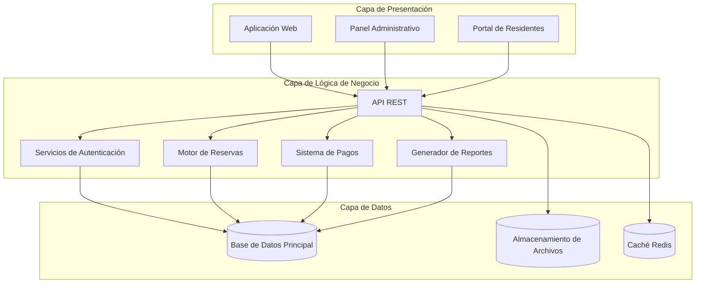
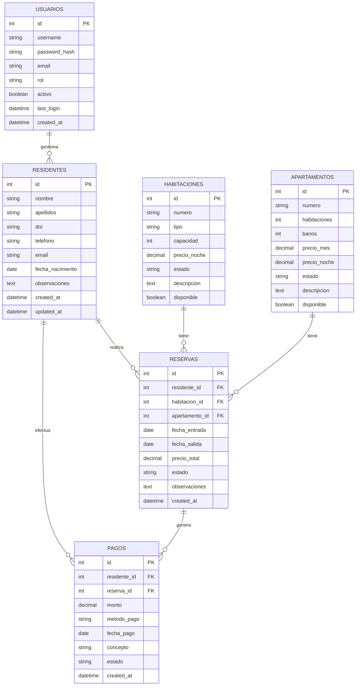
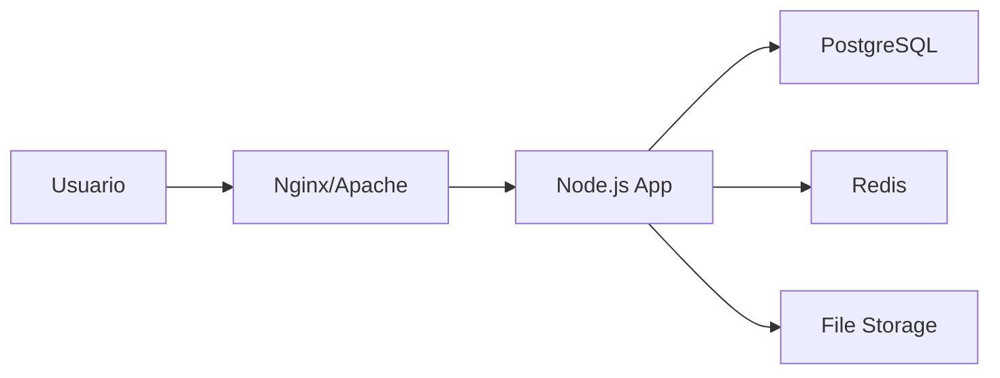

# 📘 Documento Técnico - Sistema de Gestión para Residencia

> **Versión:** 1.0  
> **Fecha:** 2026-02-05  
> **Estado:** En Desarrollo

---

## 1. Resumen Ejecutivo

Sistema integral de gestión para residencia tipo pensión con apartamentos, diseñado para optimizar la administración de reservas, residentes, pagos y operaciones diarias.

### 1.1 Objetivos del Sistema

- Centralizar la gestión de habitaciones y apartamentos
- Automatizar procesos de reservas y check-in/check-out
- Facilitar el control financiero y facturación
- Mejorar la comunicación entre personal y residentes
- Generar reportes y estadísticas de ocupación

---

## 2. Arquitectura del Sistema

### 2.1 Tipo de Arquitectura

**Arquitectura de 3 Capas (Three-Tier Architecture)**



### 2.2 Componentes Principales

| Componente | Tecnología Propuesta | Descripción |
|------------|---------------------|-------------|
| **Frontend** | React.js + TypeScript | Interfaz de usuario moderna y responsive |
| **Backend** | Node.js + Express | API RESTful para lógica de negocio |
| **Base de Datos** | PostgreSQL | Base de datos relacional robusta |
| **Caché** | Redis | Optimización de consultas frecuentes |
| **Autenticación** | JWT + bcrypt | Sistema seguro de autenticación |
| **Almacenamiento** | AWS S3 / Local Storage | Documentos y archivos adjuntos |
| **Reportes** | PDF Generator (PDFKit) | Generación de facturas y reportes |

---

## 3. Modelo de Datos

### 3.1 Diagrama Entidad-Relación



### 3.2 Descripción de Entidades Principales

#### **RESIDENTES**
Almacena información de las personas que se hospedan en la residencia.

#### **HABITACIONES**
Gestiona las habitaciones tipo pensión (estancias cortas/medias).

#### **APARTAMENTOS**
Gestiona los apartamentos (estancias largas, más independientes).

#### **RESERVAS**
Registra todas las reservas, tanto de habitaciones como apartamentos.

#### **PAGOS**
Control financiero de todos los pagos realizados.

#### **USUARIOS**
Personal administrativo con acceso al sistema.

---

## 4. API REST - Endpoints Principales

### 4.1 Autenticación

| Método | Endpoint | Descripción |
|--------|----------|-------------|
| POST | `/api/auth/login` | Iniciar sesión |
| POST | `/api/auth/logout` | Cerrar sesión |
| POST | `/api/auth/refresh` | Renovar token |
| GET | `/api/auth/me` | Obtener usuario actual |

### 4.2 Residentes

| Método | Endpoint | Descripción |
|--------|----------|-------------|
| GET | `/api/residentes` | Listar todos los residentes |
| GET | `/api/residentes/:id` | Obtener residente específico |
| POST | `/api/residentes` | Crear nuevo residente |
| PUT | `/api/residentes/:id` | Actualizar residente |
| DELETE | `/api/residentes/:id` | Eliminar residente |
| GET | `/api/residentes/:id/historial` | Historial de reservas |

### 4.3 Habitaciones

| Método | Endpoint | Descripción |
|--------|----------|-------------|
| GET | `/api/habitaciones` | Listar habitaciones |
| GET | `/api/habitaciones/disponibles` | Habitaciones disponibles |
| GET | `/api/habitaciones/:id` | Obtener habitación específica |
| POST | `/api/habitaciones` | Crear habitación |
| PUT | `/api/habitaciones/:id` | Actualizar habitación |
| PATCH | `/api/habitaciones/:id/estado` | Cambiar estado |

### 4.4 Apartamentos

| Método | Endpoint | Descripción |
|--------|----------|-------------|
| GET | `/api/apartamentos` | Listar apartamentos |
| GET | `/api/apartamentos/disponibles` | Apartamentos disponibles |
| GET | `/api/apartamentos/:id` | Obtener apartamento específico |
| POST | `/api/apartamentos` | Crear apartamento |
| PUT | `/api/apartamentos/:id` | Actualizar apartamento |
| PATCH | `/api/apartamentos/:id/estado` | Cambiar estado |

### 4.5 Reservas

| Método | Endpoint | Descripción |
|--------|----------|-------------|
| GET | `/api/reservas` | Listar reservas |
| GET | `/api/reservas/:id` | Obtener reserva específica |
| POST | `/api/reservas` | Crear nueva reserva |
| PUT | `/api/reservas/:id` | Actualizar reserva |
| PATCH | `/api/reservas/:id/estado` | Cambiar estado reserva |
| POST | `/api/reservas/:id/checkin` | Realizar check-in |
| POST | `/api/reservas/:id/checkout` | Realizar check-out |

### 4.6 Pagos

| Método | Endpoint | Descripción |
|--------|----------|-------------|
| GET | `/api/pagos` | Listar pagos |
| GET | `/api/pagos/:id` | Obtener pago específico |
| POST | `/api/pagos` | Registrar pago |
| GET | `/api/pagos/pendientes` | Pagos pendientes |
| GET | `/api/pagos/residente/:id` | Pagos de un residente |

### 4.7 Reportes

| Método | Endpoint | Descripción |
|--------|----------|-------------|
| GET | `/api/reportes/ocupacion` | Reporte de ocupación |
| GET | `/api/reportes/ingresos` | Reporte de ingresos |
| GET | `/api/reportes/deudores` | Residentes con deudas |
| GET | `/api/reportes/factura/:id` | Generar factura PDF |

---

## 5. Seguridad

### 5.1 Autenticación y Autorización

- **JWT (JSON Web Tokens)** para autenticación stateless
- **Bcrypt** para hash de contraseñas (10 rounds)
- **Refresh Tokens** para renovación segura de sesiones
- **RBAC (Role-Based Access Control)** para permisos

### 5.2 Roles de Usuario

| Rol | Permisos |
|-----|----------|
| **Administrador** | Acceso total al sistema |
| **Recepcionista** | Gestión de reservas, check-in/out, consultas |
| **Contable** | Gestión de pagos, reportes financieros |
| **Mantenimiento** | Actualización de estado de habitaciones |

### 5.3 Medidas de Seguridad

- ✅ Validación de datos en frontend y backend
- ✅ Sanitización de inputs para prevenir SQL Injection
- ✅ Rate limiting para prevenir ataques de fuerza bruta
- ✅ HTTPS obligatorio en producción
- ✅ CORS configurado correctamente
- ✅ Headers de seguridad (Helmet.js)
- ✅ Logs de auditoría para acciones críticas

---

## 6. Infraestructura y Despliegue

### 6.1 Entornos

| Entorno | Propósito | URL |
|---------|-----------|-----|
| **Desarrollo** | Desarrollo local | `http://localhost:3000` |
| **Staging** | Pruebas pre-producción | `[PENDIENTE]` |
| **Producción** | Sistema en vivo | `[PENDIENTE]` |

### 6.2 Control de Versiones (GitHub)

El proyecto está gestionado mediante Git y alojado en GitHub.

- **Repositorio:** `https://github.com/OpenRemedit1234/residencias.git`
- **Rama Principal:** `main`

**Flujo de actualización:**
1. Realizar cambios localmente.
2. `git add .`
3. `git commit -m "Descripción del cambio"`
4. `git push origin main`

### 6.2 Requisitos del Servidor

**Servidor de Aplicación:**
- CPU: 2 cores mínimo
- RAM: 4GB mínimo (8GB recomendado)
- Almacenamiento: 50GB SSD
- Sistema Operativo: Ubuntu 22.04 LTS / Windows Server

**Base de Datos:**
- PostgreSQL 14+
- RAM: 2GB dedicada mínimo
- Almacenamiento: 20GB inicial

### 6.3 Stack de Despliegue Propuesto



**Opciones de Hosting:**
1. **VPS Tradicional** (DigitalOcean, Linode, Vultr)
2. **Cloud Managed** (AWS, Google Cloud, Azure)
3. **Servidor Local** (On-premise)

---

## 7. Instalación y Configuración

### 7.1 Requisitos Previos

```bash
# Node.js 18+ y npm
node --version  # v18.0.0 o superior
npm --version   # 9.0.0 o superior

# PostgreSQL 14+
psql --version  # 14.0 o superior

# Git
git --version
```

### 7.2 Instalación del Backend

```bash
# Clonar repositorio
git clone [REPOSITORIO]
cd residencias-backend

# Instalar dependencias
npm install

# Configurar variables de entorno
cp .env.example .env
# Editar .env con configuración específica

# Crear base de datos
npm run db:create
npm run db:migrate
npm run db:seed  # Datos de prueba (opcional)

# Iniciar servidor de desarrollo
npm run dev
```

### 7.3 Instalación del Frontend

```bash
# Ir a directorio frontend
cd residencias-frontend

# Instalar dependencias
npm install

# Configurar variables de entorno
cp .env.example .env
# Editar .env con URL del backend

# Iniciar servidor de desarrollo
npm run dev
```

### 7.4 Arranque Rápido (Windows)

Para facilitar el uso diario sin necesidad de abrir terminales manualmente, se ha incluido un script de arranque directo:

1. Localizar el archivo `ARRANCAR_SISTEMA.bat` en la raíz del proyecto.
2. Hacer doble clic sobre el archivo.
3. El script iniciará:
   - El servidor de base de datos y API (`server/index.js`).
   - El entorno de interfaz web (`vite`).
   - Una ventana del navegador en `http://localhost:5173`.

**Nota:** La ventana de terminal que se abre debe permanecer abierta mientras se use el sistema.

### 7.4 Variables de Entorno

**Backend (.env):**
```env
# Servidor
PORT=3001
NODE_ENV=development

# Base de Datos
DB_HOST=localhost
DB_PORT=5432
DB_NAME=residencias_db
DB_USER=postgres
DB_PASSWORD=[PENDIENTE]

# JWT
JWT_SECRET=[GENERAR_SECRETO_SEGURO]
JWT_EXPIRES_IN=24h
JWT_REFRESH_EXPIRES_IN=7d

# Redis
REDIS_HOST=localhost
REDIS_PORT=6379

# Almacenamiento
STORAGE_TYPE=local
UPLOAD_PATH=./uploads

# Email (opcional)
SMTP_HOST=[PENDIENTE]
SMTP_PORT=587
SMTP_USER=[PENDIENTE]
SMTP_PASSWORD=[PENDIENTE]
```

**Frontend (.env):**
```env
VITE_API_URL=http://localhost:3001/api
VITE_APP_NAME=Sistema de Gestión - Residencia
```

---

## 8. Estructura del Proyecto

### 8.1 Backend

```
residencias-backend/
├── src/
│   ├── config/          # Configuración (DB, JWT, etc.)
│   ├── controllers/     # Controladores de rutas
│   ├── models/          # Modelos de datos (Sequelize/TypeORM)
│   ├── routes/          # Definición de rutas
│   ├── middlewares/     # Middlewares (auth, validación)
│   ├── services/        # Lógica de negocio
│   ├── utils/           # Utilidades y helpers
│   ├── validators/      # Validadores de datos
│   └── app.js           # Configuración de Express
├── migrations/          # Migraciones de BD
├── seeders/             # Datos iniciales
├── tests/               # Tests unitarios e integración
├── .env.example
├── package.json
└── server.js            # Punto de entrada
```

### 8.2 Frontend

```
residencias-frontend/
├── public/              # Archivos estáticos
├── src/
│   ├── assets/          # Imágenes, iconos, etc.
│   ├── components/      # Componentes reutilizables
│   │   ├── common/      # Botones, inputs, modales
│   │   ├── layout/      # Header, sidebar, footer
│   │   └── forms/       # Formularios específicos
│   ├── pages/           # Páginas/vistas principales
│   │   ├── Dashboard/
│   │   ├── Residentes/
│   │   ├── Reservas/
│   │   ├── Habitaciones/
│   │   ├── Apartamentos/
│   │   ├── Pagos/
│   │   └── Reportes/
│   ├── services/        # Llamadas a API
│   ├── hooks/           # Custom React hooks
│   ├── context/         # Context API (estado global)
│   ├── utils/           # Funciones auxiliares
│   ├── styles/          # CSS/SCSS globales
│   ├── App.jsx
│   └── main.jsx
├── .env.example
├── package.json
└── vite.config.js
```

---

## 9. Testing

### 9.1 Estrategia de Testing

| Tipo de Test | Herramienta | Cobertura Objetivo |
|--------------|-------------|-------------------|
| **Unitarios** | Jest | 80%+ |
| **Integración** | Supertest | Endpoints críticos |
| **E2E** | Playwright/Cypress | Flujos principales |

### 9.2 Comandos de Testing

```bash
# Backend
npm run test              # Todos los tests
npm run test:unit         # Tests unitarios
npm run test:integration  # Tests de integración
npm run test:coverage     # Reporte de cobertura

# Frontend
npm run test              # Tests de componentes
npm run test:e2e          # Tests end-to-end
```

---

## 10. Mantenimiento y Monitoreo

### 10.1 Logs

- **Winston** para logging estructurado
- Niveles: error, warn, info, debug
- Rotación diaria de archivos de log
- Logs centralizados en producción

### 10.2 Monitoreo

**Métricas a monitorear:**
- Tiempo de respuesta de API
- Uso de CPU y memoria
- Conexiones a base de datos
- Errores y excepciones
- Tasa de ocupación del sistema

**Herramientas sugeridas:**
- PM2 para gestión de procesos Node.js
- Prometheus + Grafana para métricas
- Sentry para tracking de errores

### 10.3 Backups

- **Base de Datos:** Backup diario automático
- **Archivos:** Backup semanal
- **Retención:** 30 días mínimo
- **Restauración:** Procedimiento documentado y probado

---

## 11. Escalabilidad

### 11.1 Estrategias de Escalado

**Escalado Vertical:**
- Aumentar recursos del servidor actual

**Escalado Horizontal:**
- Load balancer (Nginx)
- Múltiples instancias de Node.js
- Base de datos con réplicas de lectura

### 11.2 Optimizaciones

- Caché de consultas frecuentes (Redis)
- Paginación en listados grandes
- Lazy loading de imágenes
- Compresión de respuestas (gzip)
- CDN para assets estáticos

---

## 12. Roadmap Técnico

### Fase 1: MVP (Mínimo Producto Viable)
- ✅ Autenticación básica
- ✅ CRUD de residentes
- ✅ CRUD de habitaciones y apartamentos
- ✅ Sistema de reservas básico
- ✅ Registro de pagos

### Fase 2: Funcionalidades Avanzadas
- 📋 Dashboard con estadísticas
- 📋 Generación de reportes PDF
- 📋 Sistema de notificaciones
- 📋 Calendario de ocupación visual
- 📋 Gestión de servicios adicionales

### Fase 3: Optimización
- 📋 App móvil (React Native)
- 📋 Portal para residentes
- 📋 Integración con pasarelas de pago
- 📋 Sistema de mensajería interna
- 📋 Gestión de mantenimiento

---

## 13. Glosario Técnico

| Término | Definición |
|---------|------------|
| **API REST** | Interfaz de programación que usa HTTP para comunicación |
| **JWT** | Token de autenticación basado en JSON |
| **ORM** | Object-Relational Mapping, abstracción de base de datos |
| **CRUD** | Create, Read, Update, Delete - operaciones básicas |
| **Middleware** | Función que procesa requests antes de llegar al controlador |
| **Seed** | Datos iniciales para poblar la base de datos |
| **Migration** | Script para modificar estructura de base de datos |

---

## 14. Contacto y Soporte Técnico

**Equipo de Desarrollo:**
- Programador Jefe: [PENDIENTE]
- Email: [PENDIENTE]
- Repositorio: [PENDIENTE]

**Documentación Adicional:**
- Manual de Usuario: `manual_usuario.md`
- Documento de Requisitos: `requisitos.md`
- Guía de Contribución: `CONTRIBUTING.md`

---

**Última actualización:** 2026-02-05  
**Versión del documento:** 1.0  
**Estado:** Borrador inicial - Pendiente de completar con datos específicos del cliente
